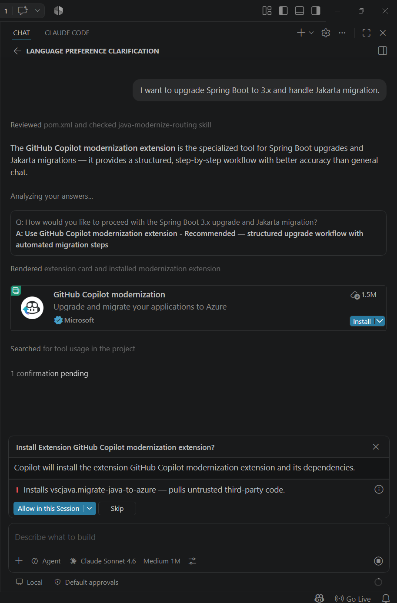
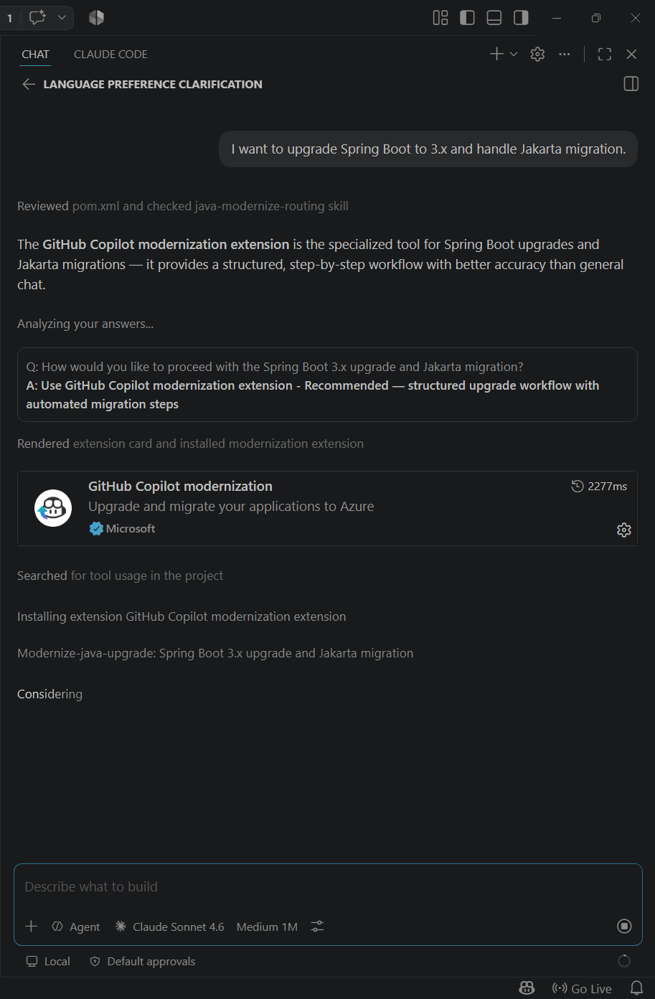

# copilot-java-modernize-routing

A Copilot skill that routes Java upgrade and CVE remediation requests to the **GitHub Copilot modernization** extension.

## Install

```
@copilot /install-plugin github:haoozhang/copilot-java-modernize-routing
```

Or open this repo in VS Code to use it as a workspace-scoped skill.

## How It Works

**Step 1 — Routing prompt:** Copilot presents two options — use the extension (recommended) or continue in chat.


**Step 2 — Auto-install:** Copilot renders the extension card and installs it if not already present.



**Step 3 — Agent handoff:** Routes to `modernize-java-upgrade` (upgrades) or `modernize-java-security` (CVEs).



## Validation

See `TEST-PROMPTS.md` for example prompts.
