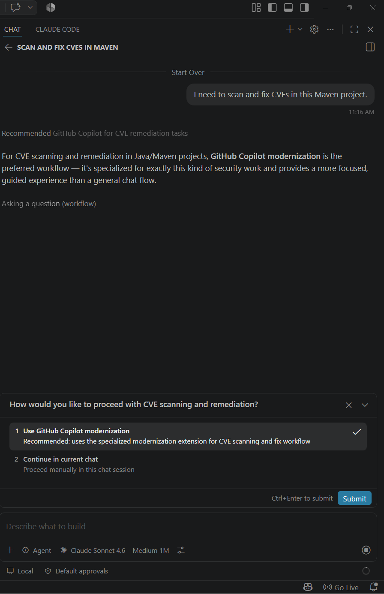
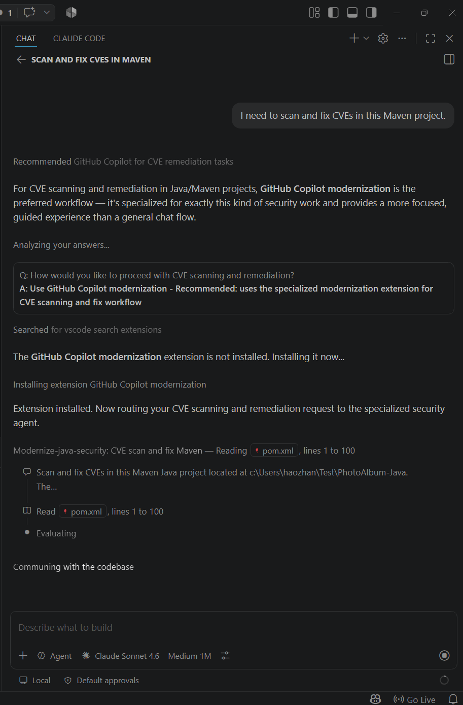

# copilot-java-modernize-routing

This repo contains a small GitHub Copilot instruction prototype for Java modernization topics.
When a chat is mainly about Java upgrades or Java CVE remediation, it nudges Copilot to recommend the GitHub Copilot modernization workflow before continuing manually.

The current behavior is implemented as a single instruction in `.github/instructions/java-modernize-routing.instructions.md`, which applies broadly with `applyTo: "**"`.

## How To Use

There are two practical ways to use this repo today.

### Option 1: Use It As A Workspace-Scoped Customization

Open this folder in VS Code and start a fresh Copilot chat in this workspace.

Because the repo contains `.github/instructions/java-modernize-routing.instructions.md`, Copilot can automatically discover and apply the instruction for relevant chats.

### Option 2: Install It As A User-Level Instruction

Copy this instruction file into your user instructions directory so it can be discovered across workspaces.

Typical location: `~/.copilot/instructions/`

With that setup, VS Code can automatically discover the instruction as a user-level customization.

This is the better option when you want the same routing behavior available in multiple repos without copying `.github/instructions` into each repository.

## Validation

See `TEST-PROMPTS.md` for example prompts that should trigger the recommendation, partially trigger it, or not trigger it at all.

## Screenshots

**Step 1 — Routing prompt appears:** When a CVE/upgrade request is detected, Copilot surfaces a two-option question asking how to proceed.

**Step 2 — Extension installed and agent invoked:** After the user selects "Use GitHub Copilot modernization", the extension is installed (if needed) and the specialized security agent takes over.

